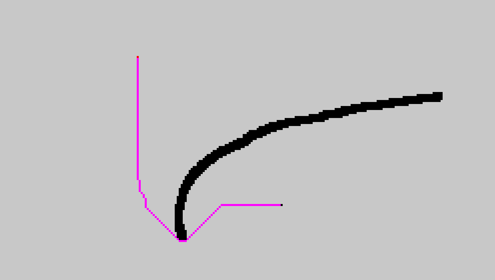
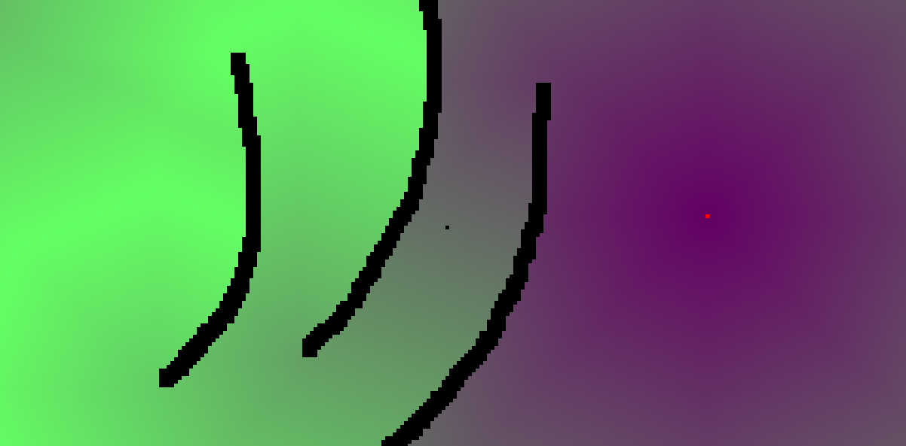

# Pathfinding

A-Star and flowfield pathfinding algorithm.
Choice of algorithm can be changed in realtime.
Terrain can be changed in realtime too.

Press V to change algorithm.\
Press R to reset walls.\
Left click to put wall.\
Right click to indicate direction\
Mouse wheels or +/- to change wall size

`cargo run --release`

